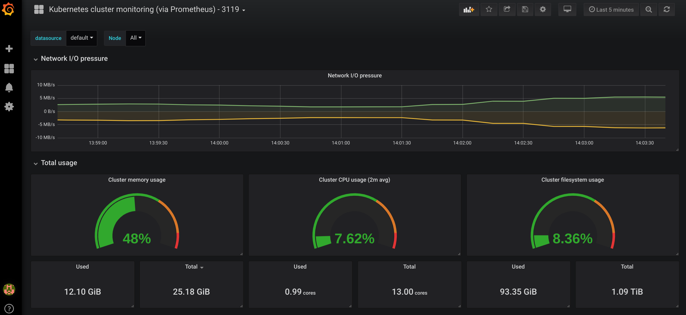

# FPCO Monitoring and Metrics



## Prerequisites

This document assumes that you have a working 1.8.x kubernetes cluster (with RBAC enabled).

### Deploy helm's tiller

Helm uses a server side component called [tiller](https://docs.gitlab.com/ee/install/kubernetes/preparation/tiller.html)
which we first have to deploy.

```
apiVersion: v1
kind: ServiceAccount
metadata:
  name: tiller
  namespace: kube-system
---
apiVersion: rbac.authorization.k8s.io/v1
kind: ClusterRoleBinding
metadata:
  name: tiller
roleRef:
  apiGroup: rbac.authorization.k8s.io
  kind: ClusterRole
  name: cluster-admin
subjects:
- kind: ServiceAccount
  name: tiller
  namespace: kube-system
```

Save this to `tiller.yaml` and then run:

```
kubectl apply -f tiller.yaml
helm init --service-account tiller

```

`NOTE`: We are using helm 2.7.x. Kubernetes (and accompanying tools like kubectl) 1.8.x.

### FPCO/Foundation

Add the fpco helm repo:

```
helm repo add fpco https://s3.amazonaws.com/fpco-charts/stable/
helm update
```

Install fpco/foundation. See [here](https://github.com/fpco/helm-charts/blob/master/foundation/README.md) for more detailed instructions.

### Nginx Ingress

We must deploy a [nginx-ingress](https://github.com/helm/charts/tree/master/stable/nginx-ingress) controller. We're
going to use the stable chart from the helm repo:


```
# Have to set replicaCount and minAvailable. See: https://github.com/kubernetes/kops/issues/2537#issuecomment-399382465
## Install nginx ingress controller with helm
helm upgrade --install \
    fpco-ingress stable/nginx-ingress \
    --version 0.28.3 \
    --set controller.image.tag="0.20.0" \
    --set controller.publishService.enabled=true \
    --set controller.config.proxy_buffer_size="16k" \
    --set controller.stats.enabled=true \
    --set controller.metrics.enabled=true \
    --set controller.podLabels.jobLabel="nginx-ingress" \
    --set controller.minAvailable=2 \
    --set defaultBackend.minAvailable=2 \
    --set controller.replicaCount=4 \
    --set defaultBackend.replicaCount=4 \
    --set rbac.create=true
```

`NOTE`: We should probably add this to fpco/foundation.

### Secrets

For the deployment to work you have to create the alertmanager secret file:

```
kubectl create secret generic alertmanager-fpco-monitoring-alertmanager --from-file=/tmp/alertmanager.yaml
```

Please see `alertmanager.yaml.example` for an example of this file.

The name of the secret __must be__ alertmanager-<ALERTMANAGER_NAME> since helm interpolates the release name.
Our alertmanager is called `fpco-monitoring-alertmanager`.

### Basic auth

Prometheus and AlertManager do not support any sort of authentication mechanism. In order to restrict access
to them we put `basic auth` in front (this will likely change soon).

To create a basic auth file use `htpasswd -c ./auth admin`, enter a password and then run:

```
kubectl create secret generic basic-auth --from-file=auth
```

`NOTE`: when creating the basic auth file with `htpasswd -c ./auth admin` it's important to name the file just `auth`.
This is later expected to exist when mounting the secret so naming it anything else will likely not work.

## Installing fpco/monitoring

The install process is done in 2 phases. This is partially because of the limitation of the version of helm
and kubernetes that we're using. Once we upgrade to k8s 1.10+ we will most likely not need to do this anymore.

```
export CHART_NAME=fpco/monitoring

helm upgrade  --install -f settings.yaml fpco-monitoring $CHART_NAME \
    --set phase1=true \
    --namespace=monitoring
```

Then we install the rest:

```
helm upgrade -f settings.yaml  --install fpco-monitoring $CHART_NAME \
    --set phase1=true \
    --set phase2=true \
    --namespace=monitoring
```

`NOTE`: See `settings.yaml.example` for how to configure fpco/monitoring. Most likely you can just change
the placeholders denoted with `<ALLCAPS>`.


### NOTES:

* Nginx Dashboard imported from: https://github.com/kubernetes/ingress-nginx/tree/master/deploy/grafana/dashboards
* Kubernetes cluster monitoring dashboard impored from: https://grafana.com/dashboards/3119
